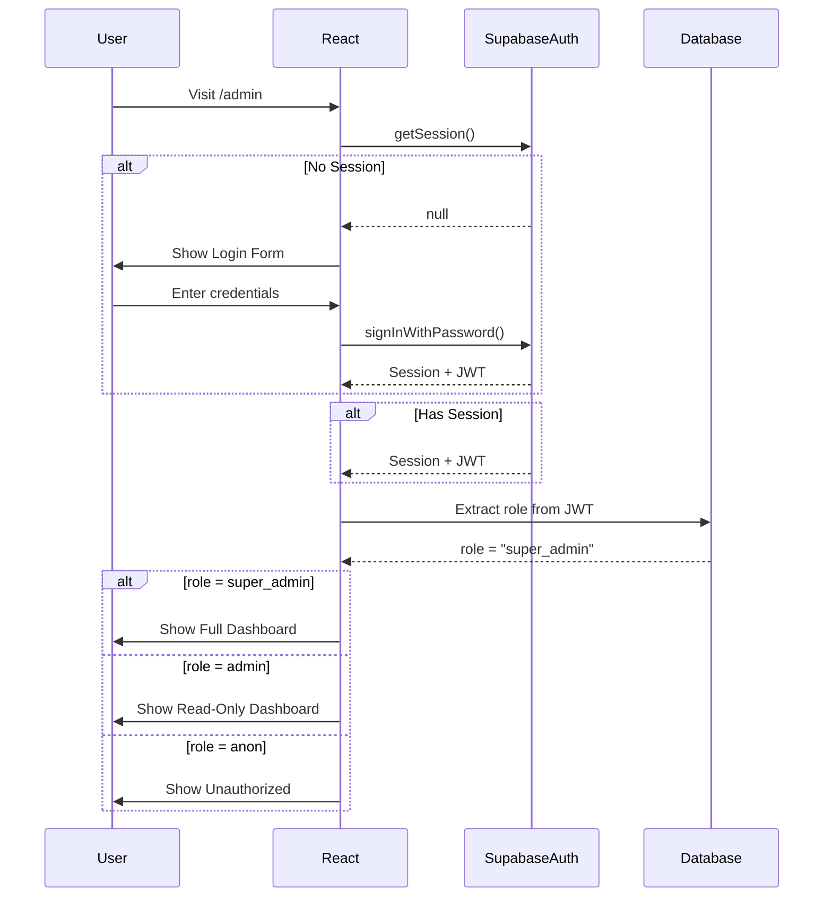

# 🔐 Slide 04: Flujo de Autenticación

## Admin Panel - Login y Verificación de Roles

```
┌─────────────────────────────────────────────────────────────────────────────┐
│                    AUTHENTICATION FLOW                                      │
└─────────────────────────────────────────────────────────────────────────────┘

╔═════════════════════════════════════════════════════════════════════════════╗
║  STEP 1: USER VISITS /admin                                                ║
╠═════════════════════════════════════════════════════════════════════════════╝

                              ┌───────────────┐
                              │  /admin       │
                              │  (React)      │
                              └───────┬───────┘
                                      │
                                      ▼
╔═════════════════════════════════════════════════════════════════════════════╗
║  STEP 2: CHECK EXISTING SESSION                                            ║
╠═════════════════════════════════════════════════════════════════════════════╝

                    ┌───────────────────────────┐
                    │  Supabase Auth            │
                    │  getSession()             │
                    └───────────┬───────────────┘
                                │
                    ┌───────────▼─────────────┐
                    │  Session exists?        │
                    └───────────┬─────────────┘
                                │
              ┌─────────────────┼─────────────────┐
              │ YES             │                 │ NO
              ▼                 │                 ▼
╔═══════════════════════╗      │    ╔═════════════════════════════════════╗
║  STEP 3A: VALIDATE    ║      │    ║  STEP 3B: SHOW LOGIN                ║
║  ROLE FROM JWT        ║      │    ╠═════════════════════════════════════╝
╚═══════════════════════╝      │               │
              │                 │        ┌──────▼──────┐
              │                 │        │ Login Form   │
              ▼                 │        │ (Email/Pass) │
╔═══════════════════════╗      │        └──────┬──────┘
║  Extract from JWT:   ║      │                 │
║  user_metadata.role  ║      │                 ▼
║  = 'admin' |         ║      │    ╔═════════════════════════════════════╗
║  'super_admin'       ║      │    ║  STEP 4: AUTHENTICATE               ║
╚═══════════════════════╝      │    ╚═════════════════════════════════════╝
              │                         │
              ▼                         ▼
╔═══════════════════════════╗  ┌────────────────────────┐
║  AUTHORIZED                ║  │  Supabase Auth         │
║  → Show Dashboard          ║  │  signInWithPassword()  │
╚═══════════════════════════╝  └───────────┬────────────┘
                                             │
                                             ▼
                                  ╔═══════════════════════════╗
                                  ║  SUCCESS → Get Session     ║
                                  ║  + Extract role            ║
                                  ╚═══════════════════════════╝
                                             │
                                             ▼
                                  ╔═══════════════════════════╗
                                  ║  role = 'super_admin'?    ║
                                  ║    → Full access          ║
                                  ║  role = 'admin'?          ║
                                  ║    → Read-only            ║
                                  ╚═══════════════════════════╝
```

---

## Role-Based Access Control (RBAC)

```
┌─────────────────────────────────────────────────────────────────────────────┐
│                         ROLES DEFINED                                       │
└─────────────────────────────────────────────────────────────────────────────┘

┌─────────────────┐     ┌─────────────────┐     ┌─────────────────┐
│     ANON        │     │     USER        │     │     ADMIN       │
│   (Anonymous)   │     │ (Authenticated) │     │   (staff)       │
├─────────────────┤     ├─────────────────┤     ├─────────────────┤
│ ❌ Read docs    │     │ ✅ Read docs    │     │ ✅ Read docs    │
│ ❌ Write docs   │     │ ❌ Write docs   │     │ ✅ Create docs  │
│ ❌ Delete docs  │     │ ❌ Delete docs  │     │ ✅ Update docs  │
│                 │     │                 │     │ ❌ Delete docs  │
└─────────────────┘     └─────────────────┘     └─────────────────┘

┌─────────────────┐
│   SUPER_ADMIN   │
│   (owner)       │
├─────────────────┤
│ ✅ Read docs    │
│ ✅ Create docs  │
│ ✅ Update docs  │
│ ✅ Delete docs  │
│ ✅ Manage users │
└─────────────────┘
```

---

## JWT Token Structure

```
┌─────────────────────────────────────────────────────────────────────────────┐
│                         JWT PAYLOAD EXAMPLE                                 │
└─────────────────────────────────────────────────────────────────────────────┘

{
  "iss": "https://your-project.supabase.co",
  "aud": "authenticated",
  "sub": "user-uuid-1234",
  "exp": 1738000000,
  "iat": 1737996400,
  "role": "authenticated",
  "user_metadata": {
    "email": "admin@smartconnect.ai",
    "email_verified": true,
    "role": "super_admin"          ←─────────────────┐
  },                                            │ CLAVE
  "app_metadata": {                             │
    "provider": "email",                         │
    "providers": ["email"]                      │
  }                                             ▼
}
```

---

## Security Layers

```
┌─────────────────────────────────────────────────────────────────────────────┐
│                    SECURITY MULTI-LAYER                                     │
└─────────────────────────────────────────────────────────────────────────────┘

┌─────────────────────────────────────────────────────────────────────────────┐
│ LAYER 1: FRONTEND (UI)                                                   │
│ • Hide buttons based on role                                               │
│ • Show/hide menu items                                                    │
└─────────────────────────────────────────────────────────────────────────────┘
                                    │
                                    ▼
┌─────────────────────────────────────────────────────────────────────────────┐
│ LAYER 2: USE CASE (Business Logic)                                        │
│ • Validate permissions in domain layer                                     │
│ • throw Error('Insufficient permissions')                                  │
└─────────────────────────────────────────────────────────────────────────────┘
                                    │
                                    ▼
┌─────────────────────────────────────────────────────────────────────────────┐
│ LAYER 3: RLS (Database)                                                    │
│ • Supabase Row Level Security policies                                     │
│ • Even if code bypassed, DB denies access                                  │
└─────────────────────────────────────────────────────────────────────────────┘
                                    │
                                    ▼
┌─────────────────────────────────────────────────────────────────────────────┐
│ LAYER 4: EDGE FUNCTION (API)                                               │
│ • Validate JWT on every request                                            │
│ • Return 401 if invalid                                                    │
└─────────────────────────────────────────────────────────────────────────────┘
```

---

## Flow Diagram (Mermaid)


