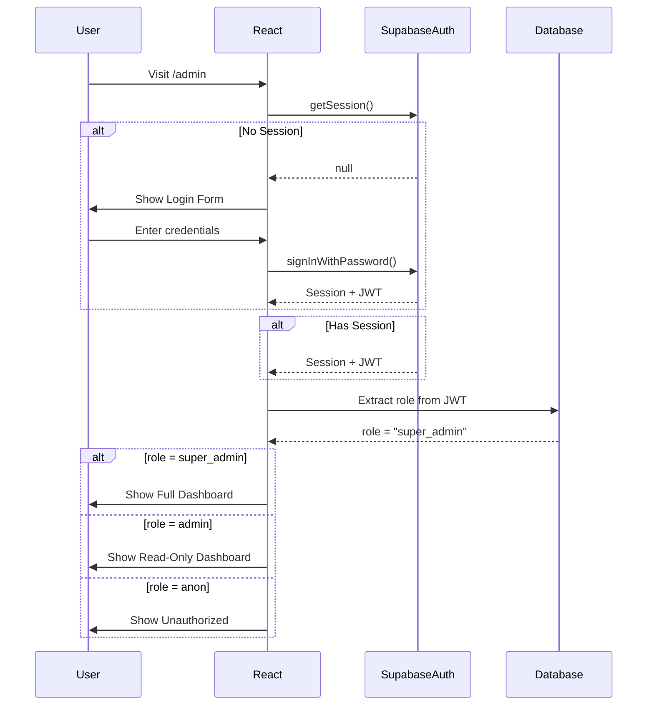

# 🔐 Slide 04: Flujo de Autenticación

## Admin Access Credentials

```
┌─────────────────────────────────────────────────────────────────────────────┐
│                    ADMIN PANEL ACCESS                                       │
├─────────────────────────────────────────────────────────────────────────────┤
│                                                                             │
│  URL:  /admin                                                              │
│                                                                             │
│  ┌─────────────────────────────────────────────────────────────────────┐   │
│  │  Email:    admin@smartconnect.ai                                     │   │
│  │  Password: bigSchool                                                 │   │
│  └─────────────────────────────────────────────────────────────────────┘   │
│                                                                             │
│  ⚠️  IMPORTANTE: Estas credenciales son de producción.                     │
│      No compartir.                                                          │
│                                                                             │
└─────────────────────────────────────────────────────────────────────────────┘
```

## Admin Panel - Login y Verificación de Roles

```
┌─────────────────────────────────────────────────────────────────────────────┐
│                    AUTHENTICATION FLOW                                      │
└─────────────────────────────────────────────────────────────────────────────┘

╔═════════════════════════════════════════════════════════════════════════════╗
║  STEP 1: USER VISITS /admin                                                ║
╠═════════════════════════════════════════════════════════════════════════════╝

                              ┌───────────────┐
                              │  /admin       │
                              │  (React)      │
                              └───────┬───────┘
                                      │
                                      ▼
╔═════════════════════════════════════════════════════════════════════════════╗
║  STEP 2: CHECK EXISTING SESSION                                            ║
╠═════════════════════════════════════════════════════════════════════════════╝

                    ┌───────────────────────────┐
                    │  Supabase Auth            │
                    │  getSession()             │
                    └───────────┬───────────────┘
                                │
                    ┌───────────▼─────────────┐
                    │  Session exists?        │
                    └───────────┬─────────────┘
                                │
              ┌─────────────────┼─────────────────┐
              │ YES             │                 │ NO
              ▼                 │                 ▼
╔═══════════════════════╗      │    ╔═════════════════════════════════════╗
║  STEP 3A: VALIDATE    ║      │    ║  STEP 3B: SHOW LOGIN                ║
║  EMAIL FROM JWT        ║      │    ╠═════════════════════════════════════╝
╚═══════════════════════╝      │               │
              │                 │        ┌──────▼──────┐
              │                 │        │ Login Form   │
              ▼                 │        │ (Email/Pass) │
╔═══════════════════════╗      │        └──────┬──────┘
║  Extract from JWT:   ║      │                 │
║  email ===            ║      │                 ▼
║  'admin@smartconnect│      │    ╔═════════════════════════════════════╗
║  .ai'                ║      │    ║  STEP 4: AUTHENTICATE               ║
╚═══════════════════════╝      │    ╚═════════════════════════════════════╝
              │                         │
              ▼                         ▼
╔═══════════════════════════╗  ┌────────────────────────┐
║  AUTHORIZED                ║  │  Supabase Auth         │
║  → Show Dashboard          ║  │  signInWithPassword()  │
╚═══════════════════════════╝  └───────────┬────────────┘
                                             │
                                             ▼
                                  ╔═══════════════════════════╗
                                  ║  SUCCESS → Get Session     ║
                                  ║  + Extract email           ║
                                  ╚═══════════════════════════╝
                                             │
                                             ▼
                                  ╔═══════════════════════════╗
                                  ║  email =                  ║
                                  ║  'admin@smartconnect.ai'? ║
                                  ║    → Full access          ║
                                  ║  Otherwise?               ║
                                  ║    → Denied               ║
                                  ╚═══════════════════════════╝
```

---

## Role-Based Access Control (RBAC)

```
┌─────────────────────────────────────────────────────────────────────────────┐
│                    ADMIN ACCESS MODEL                                       │
├─────────────────────────────────────────────────────────────────────────────┤
│                                                                             │
│  ┌─────────────────────────────────────────────────────────────────────┐   │
│  │  ADMIN: admin@smartconnect.ai                                       │   │
│  │  • Full CRUD access to documents                                    │   │
│  │  • Full CRUD access to app_settings                                 │   │
│  │  • Read security_logs                                               │   │
│  └─────────────────────────────────────────────────────────────────────┘   │
│                                                                             │
│  ┌─────────────────────────────────────────────────────────────────────┐   │
│  │  ANONYMOUS (chatbot):                                               │   │
│  │  • SELECT on documents (for RAG)                                   │   │
│  │  • SELECT on app_settings (for landing page)                       │   │
│  └─────────────────────────────────────────────────────────────────────┘   │
│                                                                             │
└─────────────────────────────────────────────────────────────────────────────┘
```

```
┌─────────────────────────────────────────────────────────────────────────────┐
│                         ROLES DEFINED                                       │
└─────────────────────────────────────────────────────────────────────────────┘

┌─────────────────┐     ┌─────────────────┐     ┌─────────────────┐
│     ANON        │     │     USER        │     │     ADMIN       │
│   (Anonymous)   │     │ (Authenticated) │     │   (staff)       │
├─────────────────┤     ├─────────────────┤     ├─────────────────┤
│ ❌ Read docs    │     │ ✅ Read docs    │     │ ✅ Read docs    │
│ ❌ Write docs   │     │ ❌ Write docs   │     │ ✅ Create docs  │
│ ❌ Delete docs  │     │ ❌ Delete docs  │     │ ✅ Update docs  │
│                 │     │                 │     │ ❌ Delete docs  │
└─────────────────┘     └─────────────────┘     └─────────────────┘

┌─────────────────┐
│   SUPER_ADMIN   │
│   (owner)       │
├─────────────────┤
│ ✅ Read docs    │
│ ✅ Create docs  │
│ ✅ Update docs  │
│ ✅ Delete docs  │
│ ✅ Manage users │
└─────────────────┘
```

---

## JWT Token Structure

```
┌─────────────────────────────────────────────────────────────────────────────┐
│                         JWT PAYLOAD EXAMPLE                                 │
└─────────────────────────────────────────────────────────────────────────────┘

{
  "iss": "https://your-project.supabase.co",
  "aud": "authenticated",
  "sub": "user-uuid-1234",
  "exp": 1738000000,
  "iat": 1737996400,
  "role": "authenticated",
  "email": "admin@smartconnect.ai",     ←── CLAVE: verificar este email
  "email_verified": true,
  "user_metadata": {
    "email": "admin@smartconnect.ai",
    "email_verified": true
  },
  "app_metadata": {
    "provider": "email",
    "providers": ["email"]
  }
}
```

> ⚠️ **SIMPLE**: Verificamos `email` en el JWT. El email está verificado por Supabase Auth.
> - admin@smartconnect.ai → Acceso completo
> - Cualquier otro email → Acceso denegado
```

---

## Security Layers

```
┌─────────────────────────────────────────────────────────────────────────────┐
│                    SECURITY MULTI-LAYER                                     │
└─────────────────────────────────────────────────────────────────────────────┘

┌─────────────────────────────────────────────────────────────────────────────┐
│ LAYER 1: FRONTEND (UI)                                                     │
│ • Hide admin buttons if not authenticated                                  │
│ • Show admin menu only for admin@smartconnect.ai                           │
└─────────────────────────────────────────────────────────────────────────────┘
                                    │
                                    ▼
┌─────────────────────────────────────────────────────────────────────────────┐
│ LAYER 2: USE CASE (Business Logic)                                         │
│ • Validate email === 'admin@smartconnect.ai' in repository                 │
│ • throw Error('Insufficient permissions')                                  │
└─────────────────────────────────────────────────────────────────────────────┘
                                    │
                                    ▼
┌─────────────────────────────────────────────────────────────────────────────┐
│ LAYER 3: RLS (Database)                                                    │
│ • Supabase RLS verifies email in JWT                                        │
│ • Even if code bypassed, DB denies non-admin operations                    │
└─────────────────────────────────────────────────────────────────────────────┘
                                    │
                                    ▼
┌─────────────────────────────────────────────────────────────────────────────┐
│ LAYER 4: EDGE FUNCTION (API)                                               │
│ • Validate JWT on every request                                             │
│ • Return 401 if invalid                                                     │
└─────────────────────────────────────────────────────────────────────────────┘
```

---

## Flow Diagram (Mermaid)



---


